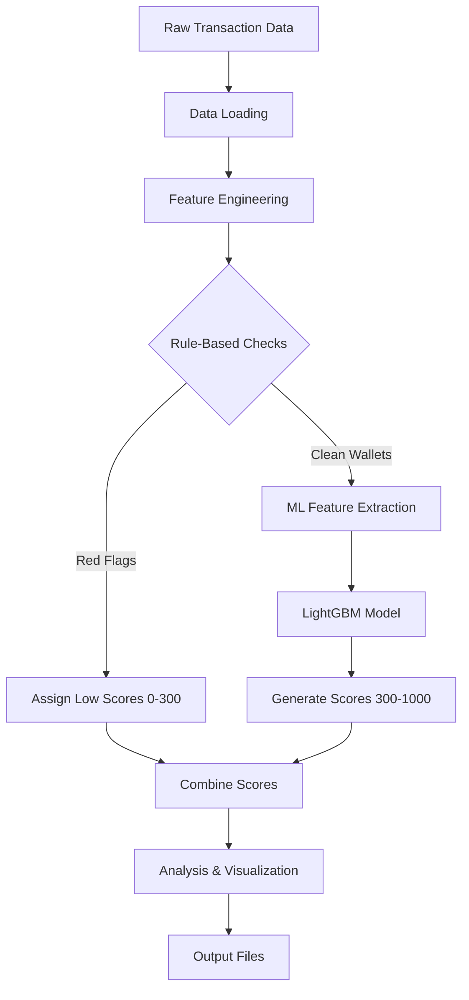

# Problem Statement
### Your Challenge

You are provided with sample 100K raw, transaction-level data from the Aave V2 protocol. Each record corresponds to a wallet interacting with the protocol through actions such as `deposit`, `borrow`, `repay`, `redeemunderlying`, and `liquidationcall`.

Your task is to develop a robust machine learning model that assigns a **credit score between 0 and 1000** to each wallet, based solely on historical transaction behavior. Higher scores indicate reliable and responsible usage; lower scores reflect risky, bot-like, or exploitative behavior.

Decide which features to engineer from DeFi transaction data
Implement a one-step script that generates wallet scores from a json file which contains the a small sample of user-transactions.

Validate and explain the score logic in a one-page README for transparency and extensibility.

### Link to the user-transactions json file:

The below file is raw json file (~87MB)

https://drive.google.com/file/d/1ISFbAXxadMrt7Zl96rmzzZmEKZnyW7FS/view?usp=sharing

Or if you prefer the compressed zip file (~10MB)

https://drive.google.com/file/d/14ceBCLQ-BTcydDrFJauVA_PKAZ7VtDor/view?usp=sharing


# Aave V2 Wallet Credit Scoring System
## Overview
This repository contains a robust machine learning solution for assigning credit scores (0-1000) to Aave V2 protocol wallets based solely on their historical transaction behavior. The system analyzes transaction patterns to identify reliable users versus risky or potentially malicious actors.

## Methodology
### Hybrid Scoring Approach

We implement a two-stage scoring system that combines:
---
1. **Rule-Based Scoring (for clear cases):**

    - Identifies wallets with obvious red flags (liquidations, bot-like behavior)

    - Assigns predetermined low scores (0-300)

    - Catches known patterns of risky behavior

2. **Machine Learning Scoring (for nuanced cases):**

    - Uses LightGBM gradient boosting model

    - Analyzes complex transaction patterns

    - Generates scores (300-1000) based on multiple behavioral factors
---


### Feature Engineering
Key features extracted from transaction data:

| **Feature Category**     | **Examples**                                           |
|--------------------------|--------------------------------------------------------|
| Transaction Frequency     | TX count, time between TXs, session duration          |
| Financial Behavior        | Deposit/borrow ratios, repayment velocity             |
| Risk Indicators           | Near-liquidations, flash loan usage                   |
| Long-term Stability       | Protocol tenure, consistency of usage                 |


### System Architecture


### Processing Flow
---
1. **Data Loading**
    - Handles both JSON and compressed ZIP inputs
    - Processes large files in chunks to manage memory
    - Converts timestamps to datetime objects
    
2. **Feature Engineering**
    - Groups transactions by wallet address
    - Calculates 20+ behavioral metrics per wallet
    - Handles missing data appropriately

3. **Rule-Based Filtering**
    - Checks for liquidations (auto score = 200)
    - Identifies bot-like high-frequency activity (score = 100)
    - Flags new accounts with risky behavior (score = 300)
    - Catches borrowing without deposits (score = 250)

4. **Machine Learning Scoring**

    - Trains on synthetic targets (real implementation would use labeled data)
    - Uses features like:
    - Deposit/borrow ratios
    - Account age
    - Repayment frequency
    - Outputs scores scaled to 300-800 range

5. **Result Generation**

    - Combines rule-based and ML scores
    - Clips final scores to 0-1000 range
    - Generates three output files:
    - **wallet_scores.csv**: All wallet addresses with scores
    - **score_distribution.png**: Histogram visualization
    - **analysis.md**: Detailed report with statistics

### Implementation Notes

1. **Model Training**:

    - Current implementation uses simulated targets
    - Production system would require:
      - Proper labeled data
      - Train/test split
      - Hyperparameter tuning

2. **Scalability**:

    - Processes 100K+ transactions efficiently
    - Can be extended to:
      - Database backend for larger datasets
      - Incremental updates
      - Distributed processing

3. **Extensibility**:

    - New risk rules can be added easily
    - Additional features can be incorporated
    - Model can be replaced/upgraded without changing pipeline

### Usage
To run the scoring system:

```python
# In Google Colab:
from google.colab import drive
drive.mount('/content/drive')

# Set your file path
file_path = '/content/drive/MyDrive/user_transactions.json'  # or .zip

# Run main function
main()

```
Output files will be created in the current directory and can be downloaded from Colab.