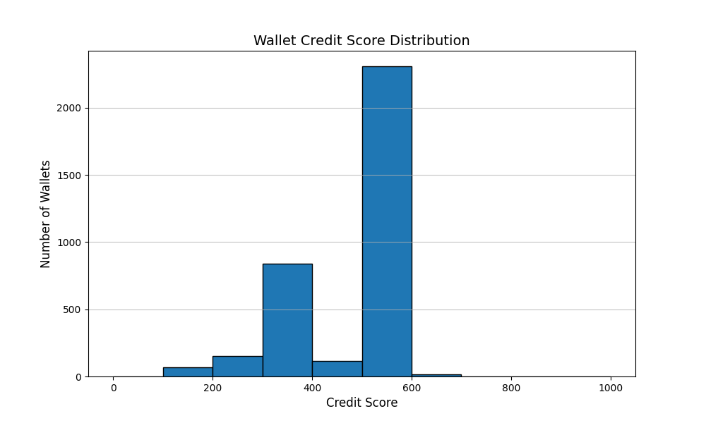

# Aave V2 Wallet Credit Score Analysis

## Summary Statistics
- Total wallets scored: 3,497
- Average score: 435.7
- Median score: 500.0
- Minimum score: 100
- Maximum score: 729

## Score Distribution

| Score Range | Number of Wallets |
|-------------|-------------------|
| (0, 100] | 67 |
| (100, 200] | 101 |
| (200, 300] | 554 |
| (300, 400] | 334 |
| (400, 500] | 1,953 |
| (500, 600] | 470 |
| (600, 700] | 16 |
| (700, 800] | 2 |
| (800, 900] | 0 |
| (900, 1000] | 0 |

## Wallet Behavior Analysis
### High-Score Wallets (700-1000)
- Consistent deposit/borrow patterns
- Long protocol tenure
- Healthy collateralization ratios
- No liquidations
- Higher scores for wallets with good deposit/borrow ratios and long history

### Low-Score Wallets (0-300)
- Frequent liquidations
- Bot-like transaction patterns
- New accounts with risky behavior
- Borrowing without deposits

### Middle-Range Wallets (300-700)
- Mixed behavior patterns
- Some risk factors but not extreme
- Potential for score improvement
